## Steps for getting Makehuman meshes animated with BVH mocap files. 

This is just meant to get you some test data to play with and get started. To go beyond using these exact files, steps and program versions you should get help from someone that knows what they are doing, I'll certainly have no clue regarding how to help you as this is far from my area of expertise.

The files I've tested are: 

*aachan.bvh, nocchi.bvh, kashiyuka.bvh* from:
[http://perfume-global.com](http://perfume-global.com)

*0018_XinJiang003.bvh* from:
[http://animation.comp.nus.edu.sg/nusmocap.html](http://animation.comp.nus.edu.sg/nusmocap.html)

*Dance Step3.bvh* from: [http://mocapbank.com/dance-step3-mocap-bip-bvh.html](http://mocapbank.com/dance-step3-mocap-bip-bvh.html) 

 
## Download and install

**Makehuman & Makehuman tools for blender:** [http://www.makehuman.org/download.php](http://www.makehuman.org/download.php)

See this super helpful page for how to install the MakeHuman tools for Blender: [https://wiki.unrealengine.com/Workflow:_MakeHuman_and_Blender](https://wiki.unrealengine.com/Workflow:_MakeHuman_and_Blender)

**Blender:** [https://www.blender.org](https://www.blender.org)

Steps

### 1. Make yourself a body mesh you like.

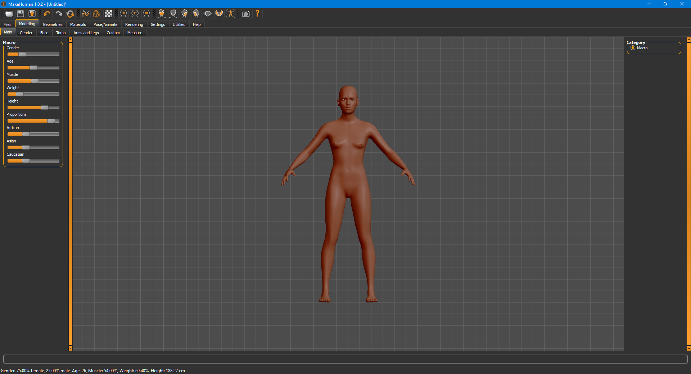

### 2. Go to Pose / Animate and give it the HumanIK skeleton

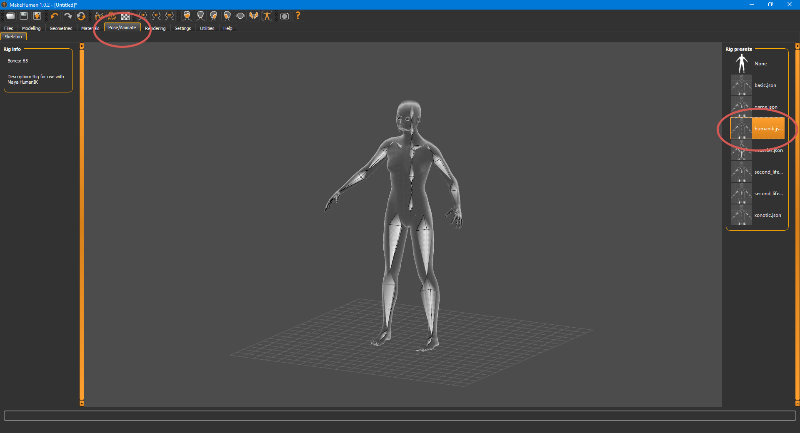

### 3. Go under Geometries/Eyes and give it the low polygon eyes

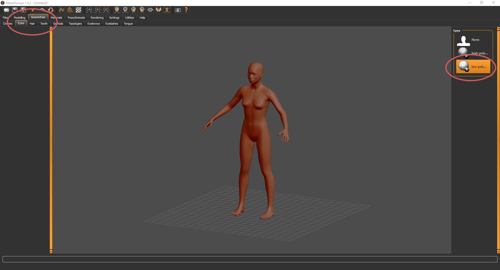

### 4. Go under Geometries/Topologies and give it the low poly body mesh, male or female.

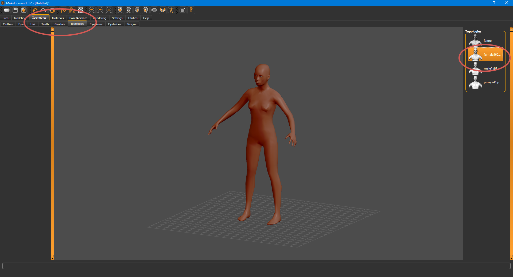

### 5. Export a Blender Exchange (MHX) file, click in Feet On Ground and Export for Rigify, I chose Decimeter but you can scale up/down later.

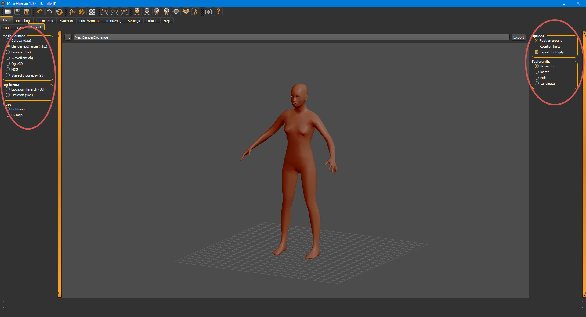

### 6. Go back to Export and export yourself a UV map as well, will come in handy for making emission masks, etc.

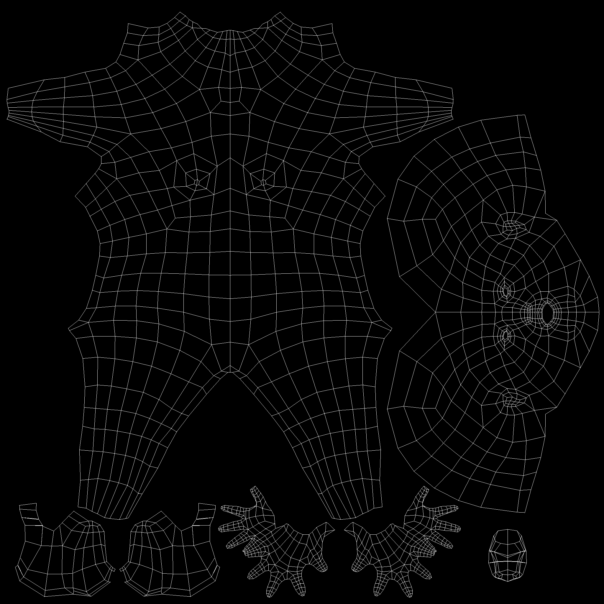

### 7. In Blender, import the MHX file.

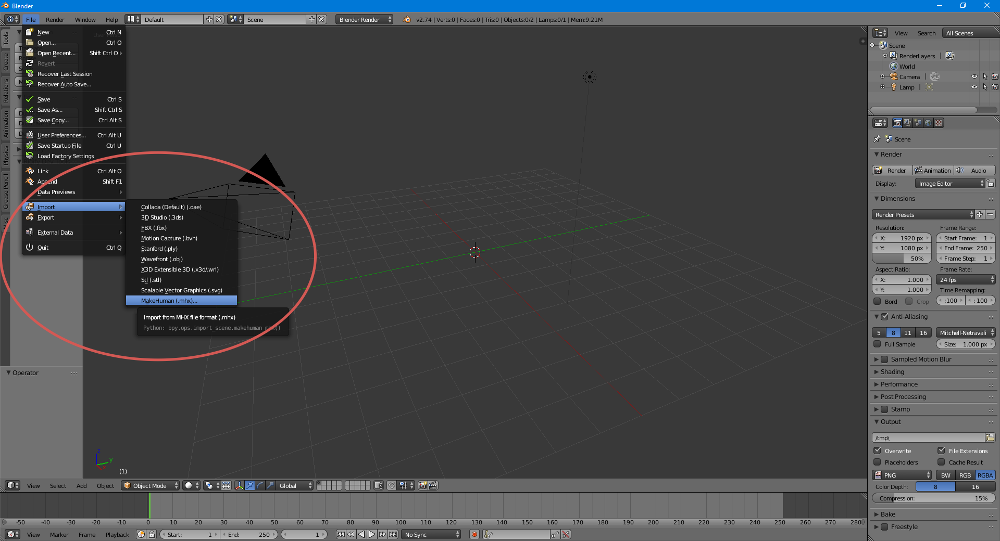

### 8. You’ll want to delete the high polygon body mesh.

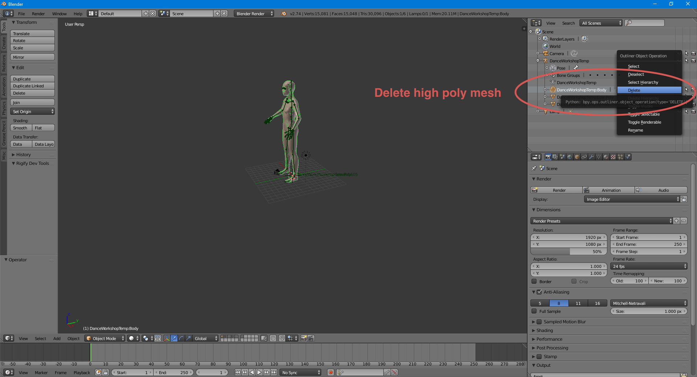

### 9. Select whatever that little body icon means on the right, go onto Misc and select Load And Retarget, make sure you set the frame range to something high so you are not missing out on frames in case it’s a long mocap. If you are not seeing this tool you did not follow the install instruction for the Makehuman Blender tools.

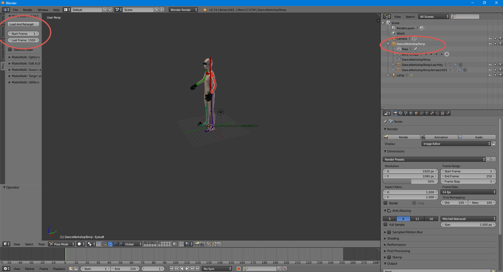

### 10. Once it has imported the animation, make sure you set your end frame to match whatever amount of frames your mocap has

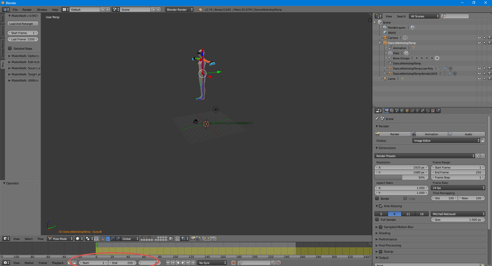

### 11. Scale the mesh down to 0.1 (Or you can do it later in your oF project) and export to FBX

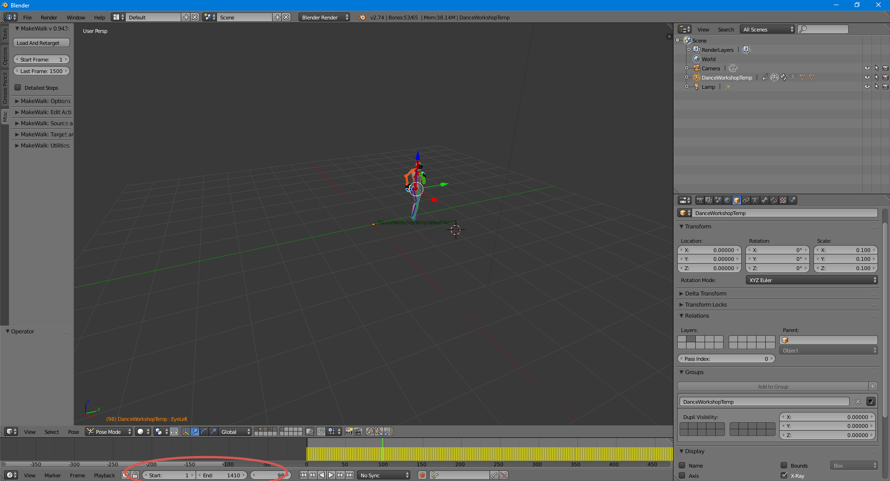

### 12. Export settings from Nick Hardeman’s ofxFBX page

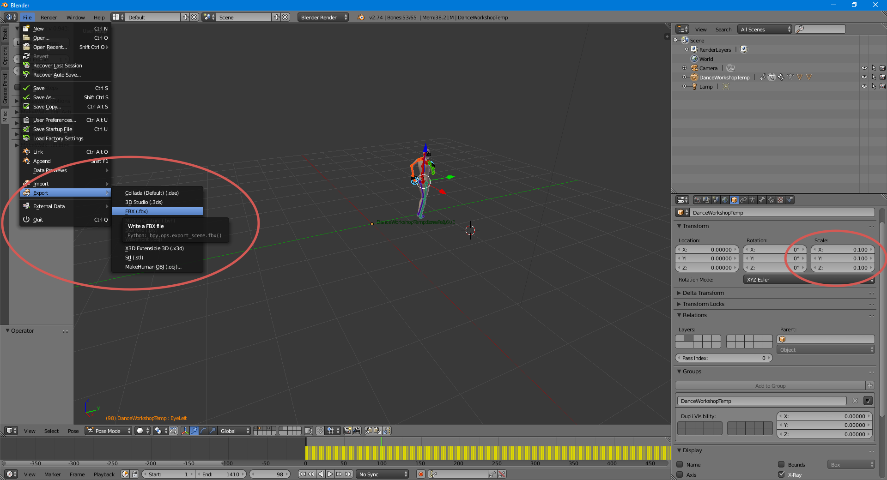

